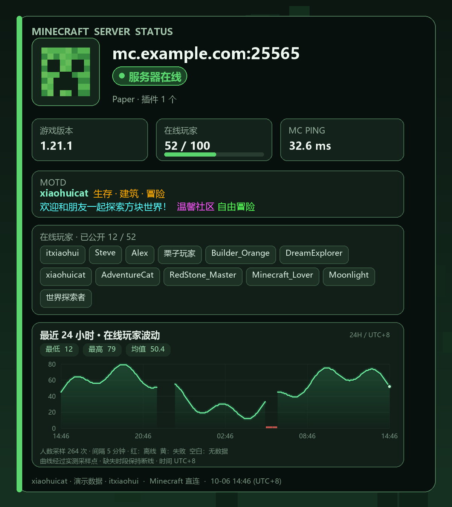

# Minecraft MOTD 与玩家波动（AstrBot）

Minecraft Java 服务器状态查询插件，适用于 AstrBot 的 QQ 官方机器人（WebSocket / Webhook）与 OneBot。保留 xiaohuicat 原机器人项目的全部 MOTD 功能，新增最近 24 小时玩家人数波动图。默认卡片署名为 `xiaohuicat`。



## 保留的功能

- `/motd`、`/mc`、`/mcstatus` 三个命令入口；群默认服务器查询与临时地址查询。
- 本群群主、群管理员或机器人管理员均可设置/清除群默认服务器，支持 `set / 设置`、`unset / clear / 清除 / 取消`。设置成功后立即查询。
- 查询在线/离线、版本、MOTD、在线/上限人数、人数进度条、完整显示已公开玩家名单、服务器图标。没有图标时显示像素苦力怕。
- Minecraft 状态握手和 ping/pong 测得的真实 RTT；保留域名 SRV 解析与显式端口。
- 保留原像素风图片；图片渲染或上传失败时回复文字，包含人数历史摘要。
- 原查询 API 地址、超时可配置；备用 API 返回的主机名、服务端软件和插件数量仍可显示。

## 新增 24 小时图表

每张状态卡下方显示平滑圆润的滚动 24 小时人数曲线，使用渐变填充和圆角描边。曲线经过真实采样点，不额外制造人数峰值，以及采样最低/最高/平均人数。`/motd history` 或 `/motd 波动` 可以直接请求带曲线的卡片，也可附带地址。

默认每 300 秒采样，优先直连 Minecraft Java 状态协议，避免公开 API 缓存影响人数变化。直连失败时使用旧项目的 mcsrvstat.us API；图中会标注 API 样本可能有缓存。服务器不公开玩家名字时仍可记录总人数。直连成功时，软件、插件数量等额外信息仍从原 API 补充（缓存 1 小时），但不会覆盖直连的人数和 Ping；API 补充的玩家名单会注明缓存样本。

群绑定的服务器持续采样；临时查询的地址从最近一次手动查询起自动跟踪 24 小时（最多跟踪最近 128 个临时地址）。多群绑定同一地址只采样一次。配置 `monitor_servers` 可添加永久跟踪地址。清除群绑定后，之前临时跟踪的剩余时间内仍可能采样；若别的群仍有绑定，会继续采样。

**首次使用不会补造过去的记录。** 首次只有一个点，持续运行后逐渐形成曲线；完整的 24 小时图需要运行采集 24 小时。停机、查询失败和离线均断开曲线，离线用红色标记、失败用黄色标记，在线 0 人会正常显示 0。时间以 UTC+8 显示。平均值是成功的人数采样平均值，不是按时间加权的全天均值。

数据库在 AstrBot 的 `data/plugin_data/astrbot_plugin_motd/motd.db` 中，默认保留 48 小时，重载和重启后保留。后台只采集数据，用户发命令时才回复卡片。停用/卸载会取消后台任务。

## MOTD 颜色与完整玩家名单

保留 Java 状态响应的原始 MOTD，支持 Minecraft `§0`–`§f` 颜色、`§x§R§R§G§G§B§B` / `§#RRGGBB` 十六进制颜色，以及 JSON 文本组件的颜色、粗体、斜体、下划线和删除线。MOTD 按原始换行和卡片宽度自动排版。

玩家名单使用独立的全宽区域，长名字自动换行，人数多时自动分页发送多张图片，不再用省略号裁剪或限制为两行。每页显示页码；只显示服务器实际返回的名字，不根据在线人数补造名单。

默认开启 `query_players`：状态响应公开的名单不足时，额外尝试 Minecraft UDP Query（最多等待 1.5 秒）。服务器管理员可以在 `server.properties` 中设置 `enable-query=true`，将 `query.port` 设置为游戏端口，并放行对应 UDP 端口，提供更完整的名单；不开启或查询失败仍正常显示状态协议已公开的名字。完整的实时名单优先于 API 缓存，补充使用 API 名单时明确标注缓存来源。参见 [mcstatus 查询说明](https://mcstatus.readthedocs.io/en/stable/api/basic/)。

## 安装

需要 Python 3.10+、AstrBot 4.16+（5.x 尚未验证）。按 [AstrBot 插件开发指南](https://docs.astrbot.app/dev/star/plugin-new.html) 的插件目录结构安装。

### 文件夹安装

将插件的整个目录复制到 **AstrBot 根目录** 的 `data/plugins/astrbot_plugin_motd/`，确认 `main.py`、`metadata.yaml`、`_conf_schema.json`、`services/` 位于同一层。在 AstrBot 使用的 Python 环境执行：

```bash
python -m pip install -r data/plugins/astrbot_plugin_motd/requirements.txt
```

随后在 AstrBot WebUI 重启/重载插件。也可从 [Releases](https://github.com/itxiaohui66/astrbot_plugin_motd/releases) 下载插件 ZIP，在支持本地 ZIP 安装的插件管理页面导入。

### 从 GitHub 安装

在 AstrBot WebUI 的插件管理中选择通过链接安装，填写：

```text
https://github.com/itxiaohui66/astrbot_plugin_motd
```

### QQ 官方机器人

1. 按 [AstrBot QQ 官方平台接入文档](https://docs.astrbot.app/platform/qqofficial.html) 接入机器人。
2. 使用 AstrBot 的 `/sid` 获取平台 ID，按 [内置命令文档](https://docs.astrbot.app/use/command.html) 在 WebUI 设置管理员，或填入本插件的 `admin_ids`。
3. 群内 @机器人发送 `/motd set 你的服务器地址`。
4. 群内 @机器人发送 `/motd` 或 `/motd history`。

插件使用 AstrBot 通用本地图片消息，由 QQ 适配器负责上传，无需 OneBot 的 `base64://` 消息。旧项目中的数字 QQ 群号与官方机器人的 group openid 不同，因此**需要在新机器人所在群重新绑定默认服务器**。管理员也应使用官方平台 ID，不能直接复制旧数字 QQ 号。

指令前缀遵循 AstrBot 的唤醒配置，默认使用 `/`。官方机器人实际接收范围、图片发送权限与平台审核以你的 QQ 机器人配置为准。

### 中文字体

Windows 自动使用系统微软雅黑。Linux / Docker 建议在 AstrBot 运行环境安装 `fonts-noto-cjk`，或将中文字体放到容器可读位置，并在 `font_path` 填写绝对路径。没有中文字体时卡片可能显示方框。

## 指令

| 指令 | 功能 |
| --- | --- |
| `/motd` | 查询本群默认服务器，并显示波动图 |
| `/motd mc.example.com` | 临时查询，不改变群默认设置 |
| `/motd mc.example.com:25565` | 指定端口查询 |
| `/motd set mc.example.com` | 群主/群管理员/机器人管理员设置本群服务器并立即查询 |
| `/motd unset` | 群主/群管理员/机器人管理员清除本群服务器 |
| `/motd identity` | 查看当前用户在本群的授权标识（不会授予权限） |
| `/motd history` | 默认服务器的状态与 24 小时波动 |
| `/motd history mc.example.com` | 指定服务器的状态与波动 |
| `/motd help` | 帮助 |

私聊可以临时查询地址；默认服务器设置/清除在群聊中使用。当前查询 Minecraft **Java 版**，保持旧项目的查询范围。

### 群管理权限

`set` 和 `unset` 都允许本群群主、本群管理员以及机器人管理员操作，普通群成员可以查询状态和历史。群角色取自平台消息中的 `sender.role` / `author.member_role`；消息没有角色时尝试通过平台群成员接口核实，不能用 AstrBot 全局 `event.is_admin()` 代替群角色。

OneBot 支持读取群消息角色及查询成员信息。QQ 官方（WebSocket / Webhook）支持读取消息原始角色，并复用当前适配器的鉴权请求查询 `/v2/groups/{group_openid}/members/{member_openid}`。实际可用性取决于机器人接口权限；[QQ SDK 的群成员接口说明](https://zhinjs.github.io/qq-official-bot/api/group.html#群成员查询) 介绍了接口权限限制。角色无法核实会明确提示，不会把普通成员当作管理员。

如果 QQ 官方接口无法提供角色，可以由机器人管理员配置**单群授权**：让该群管理人员在对应群发送 `/motd identity`，把返回的 `平台ID|群ID|用户ID` 加入插件 `group_admin_ids`。该授权只允许此人在此群管理 MOTD，不会获得全局机器人权限，也不对其他群生效。群管理人员变更后应移除旧授权。

## 配置

在 WebUI 插件配置中调整：`bot_name`、`admin_ids`、`group_admin_ids`、`api_url`、`request_timeout`、`ping_timeout`、`query_players`、`history_enabled`、`sample_interval`、`retention_hours`、`monitor_servers`、`font_path`。后台采样参数修改后重载插件。

## 本地验证与打包

```bash
python -m pip install -r requirements-dev.txt
python -m pytest
python -m ruff check .
python -m ruff format --check .
python tools/preview.py
python tools/package.py
```

自动测试覆盖实际 Minecraft 协议模拟、直连/API 切换、群设置隔离与管理员权限、后台采样、持久化、失败断线和图片降级。最终的官方 QQ 收发仍需在你实际运行的 AstrBot 和机器人账号中联调。

## 来源

命令行为、原 Minecraft API 服务、像素卡片基础移植自 itxiaohui 的原机器人项目 `liziqqbotpy`，对应模块为 `plugins/mc_motd.py`、`services/mc_api.py`、`services/motd_card.py`。保留 `itxiaohui` 技术支持署名。插件入口和消息发送依据 [AstrBot 官方开发文档](https://docs.astrbot.app/dev/star/plugin-new.html) 重写；直连查询使用 [mcstatus](https://github.com/py-mine/mcstatus)。

## 许可证

本项目以 [MIT 许可证](LICENSE) 开源。
